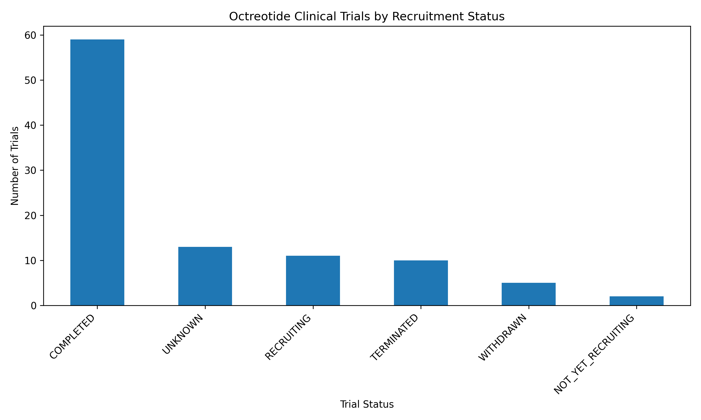
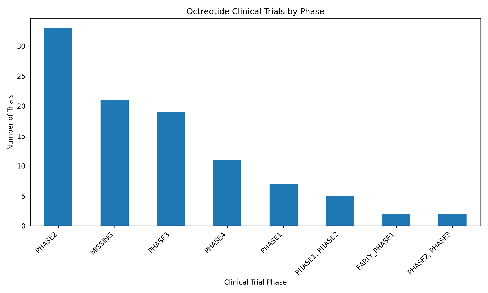
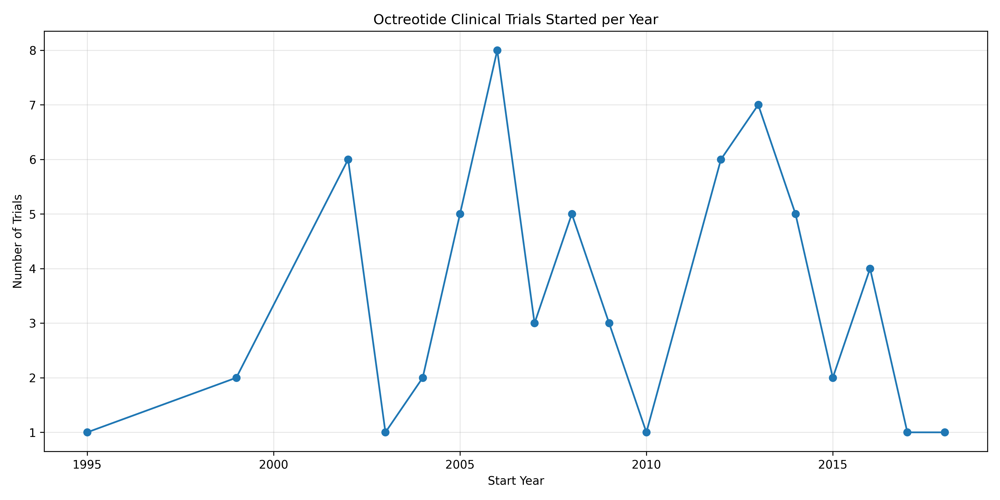
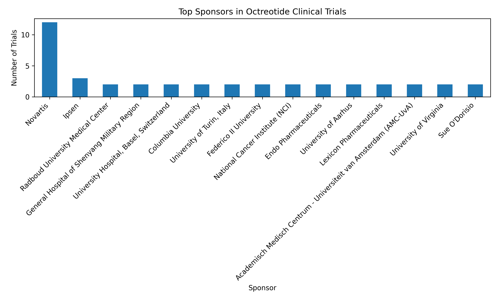
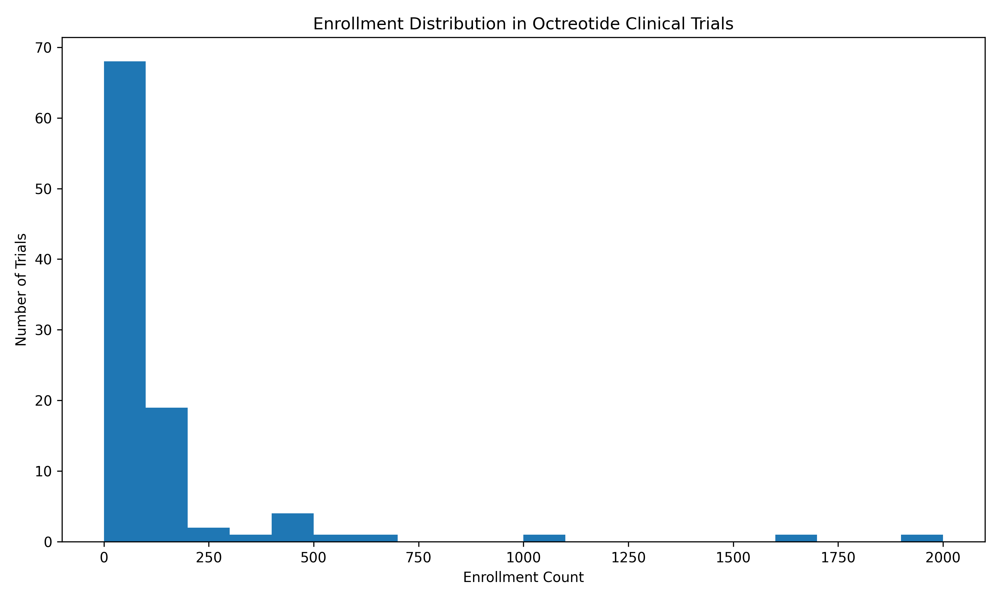
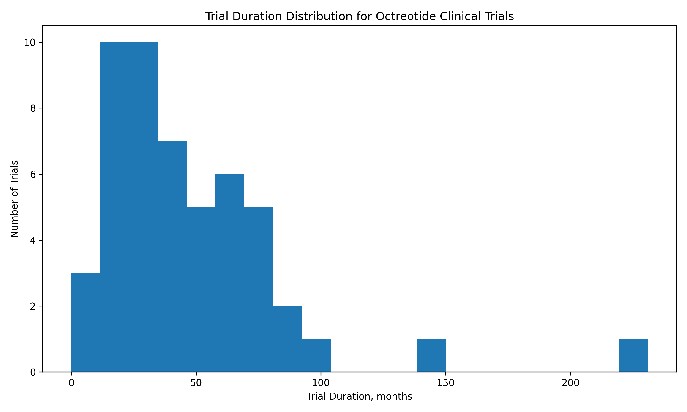

# Octreotide Clinical Trials Landscape Analysis

## Project Overview

This project analyses the clinical trial landscape for **octreotide** using publicly available data from **ClinicalTrials.gov**.

The project demonstrates a pharma-focused data science workflow, including data extraction, data cleaning, exploratory data analysis, visualisation, and structured clinical trial landscape reporting.

The analysis focuses on:

- clinical trial status distribution
- development phase landscape
- sponsor activity
- trial start trends over time
- enrollment patterns
- trial duration patterns
- active versus inactive trial activity

This project was developed as a portfolio project at the intersection of **pharmaceutical R&D**, **clinical development**, and **data science**.

---

## Data Source

Data were extracted from the **ClinicalTrials.gov API v2** using the search term:

```text
octreotide
```

The raw dataset was saved as:

```text
data/raw/clinical_trials_octreotide.xlsx
```

The cleaned dataset was saved as:

```text
data/processed/clinical_trials_octreotide_cleaned.xlsx
```

---

## Project Workflow

The project follows a script-based data pipeline:

```text
01_download_clinical_trials.py
        ↓
02_eda_cleaning.py
        ↓
03_visual_eda.py
        ↓
04_trial_landscape_summary.py
        ↓
01_octreotide_clinical_trials_eda.ipynb
```

### 1. Data Extraction

The first script downloads clinical trial records related to octreotide from ClinicalTrials.gov API v2.

Output:

```text
data/raw/clinical_trials_octreotide.xlsx
```

### 2. Data Cleaning

The cleaning script standardises column names, formats date fields, removes duplicates, cleans text fields, creates trial duration variables, and standardises sponsor names.

Key engineered fields include:

- `trial_duration_days`
- `trial_duration_months`
- `start_year`

Output:

```text
data/processed/clinical_trials_octreotide_cleaned.xlsx
```

### 3. Visual Exploratory Data Analysis

The visual EDA script generates charts and summary tables describing the octreotide clinical trial landscape.

Generated charts include:

- trial status distribution
- phase distribution
- trials started per year
- top sponsors
- enrollment distribution
- trial duration distribution

Output folder:

```text
reports/figures/
```

### 4. Landscape Summary Report

The landscape summary script generates structured tables and a written interpretation report.

Outputs:

```text
reports/tables/octreotide_trial_landscape_summary.xlsx
reports/octreotide_trial_landscape_interpretation.docx
```

### 5. Portfolio Notebook

The Jupyter notebook presents the full analysis in a portfolio-friendly format, combining code, tables, visualisations, and interpretation.

Notebook:

```text
notebooks/01_octreotide_clinical_trials_eda.ipynb
```

---

## Repository Structure

```text
clinical_trials_project/
├── data/
│   ├── raw/
│   │   └── clinical_trials_octreotide.xlsx
│   └── processed/
│       └── clinical_trials_octreotide_cleaned.xlsx
│
├── notebooks/
│   └── 01_octreotide_clinical_trials_eda.ipynb
│
├── reports/
│   ├── figures/
│   │   ├── 01_trial_status_distribution.png
│   │   ├── 02_phase_distribution.png
│   │   ├── 03_trials_by_start_year.png
│   │   ├── 04_top_sponsors.png
│   │   ├── 05_enrollment_distribution.png
│   │   └── 06_trial_duration_distribution.png
│   │
│   ├── tables/
│   │   └── octreotide_trial_landscape_summary.xlsx
│   │
│   └── octreotide_trial_landscape_interpretation.docx
│
├── scripts/
│   ├── 01_download_clinical_trials.py
│   ├── 02_eda_cleaning.py
│   ├── 03_visual_eda.py
│   └── 04_trial_landscape_summary.py
│
├── README.md
├── requirements.txt
└── .gitignore
```

---

## Key Results

The cleaned dataset contains **100 octreotide-related clinical trial records**.

Initial analysis showed that:

- a large proportion of trials were completed
- Phase 2 and Phase 3 trials represented a major part of the development landscape
- sponsor names required standardisation due to inconsistent naming conventions
- enrollment size varied substantially across trials
- trial duration showed wide variation, reflecting differences in trial design, indication, endpoint type, recruitment requirements, and follow-up duration

---

## Example Visual Outputs

### Trial Status Distribution



### Phase Distribution



### Trials Started per Year



### Top Sponsors



### Enrollment Distribution



### Trial Duration Distribution



---

## Technical Skills Demonstrated

This project demonstrates:

- Python scripting
- API data extraction
- pandas-based data cleaning
- clinical trial data wrangling
- exploratory data analysis
- matplotlib visualisation
- summary table generation
- Excel report generation
- Word report generation
- pharma-focused interpretation of public clinical trial data
- portfolio-ready project organisation

---

## Pharma and Clinical Development Relevance

This project reflects a real-world type of analysis used in pharmaceutical R&D, clinical development, competitive intelligence, and portfolio strategy.

Clinical trial registry data can support:

- competitor landscape analysis
- therapeutic area mapping
- sponsor activity tracking
- clinical development benchmarking
- recruitment burden assessment
- trial feasibility assessment
- portfolio strategy discussions

Although this project focuses on octreotide, the same workflow can be extended to other drugs, indications, modalities, or long-acting injectable products.


---

## Disclaimer

This project uses publicly available clinical trial registry data for educational and portfolio purposes. The analysis is exploratory and should not be interpreted as regulatory, clinical, or investment advice.
